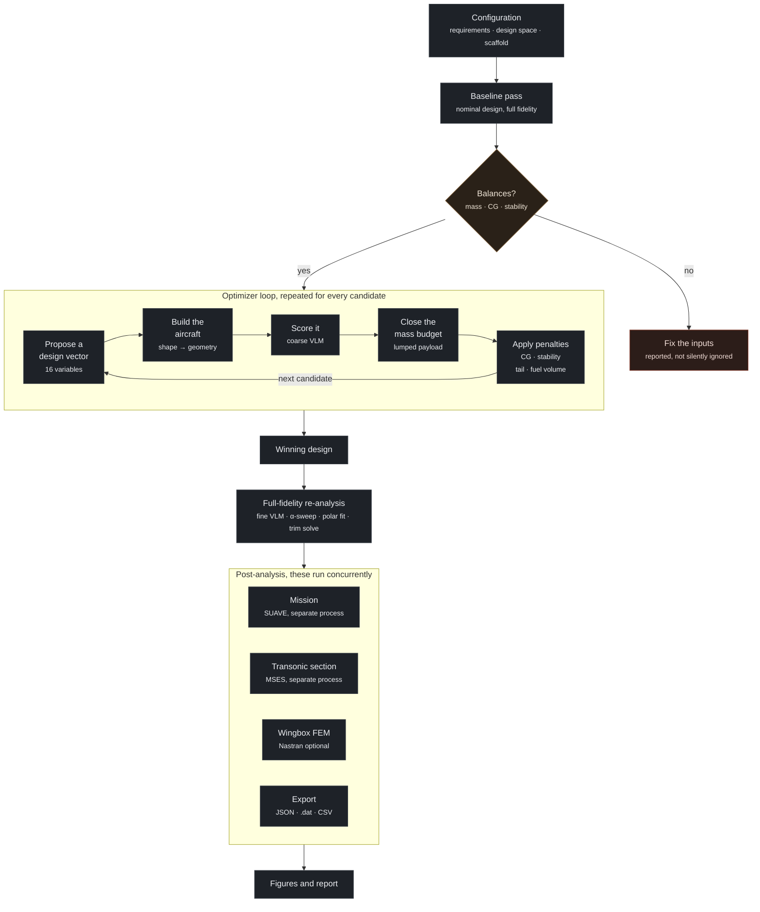
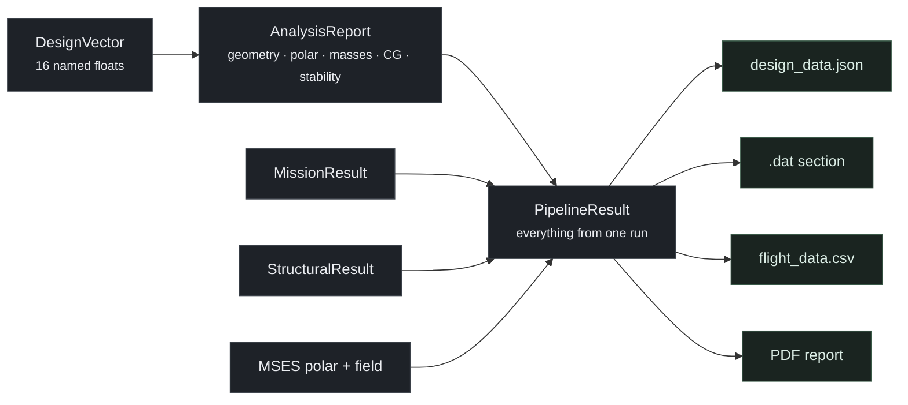

# The pipeline, end to end

One diagram for the whole program. Everything below it is a note on a part
of it.

## What happens when you press Run

## Reading it

**The baseline pass comes first, and that is deliberate.** Before any
searching happens, the design you started from is analysed in full: mass
build-up, centre of gravity, stability, payload layout. It takes seconds,
and it catches the class of mistake that would otherwise waste an entire
optimisation: a payload that cannot fit, a wing in the wrong place, a
weight target nothing can close against. If the baseline does not balance,
the answer is in your inputs, and no amount of searching will find it.

**The loop is deliberately cheap.** Every box inside the optimizer runs
once per candidate, and there are on the order of fifteen hundred
candidates. That is why the aerodynamics in the loop is a coarse
vortex-lattice solve and the payload is a lumped mass rather than a seat
map. Anything expensive gets multiplied by fifteen hundred.

**Penalties, not rejections.** A candidate that violates a constraint is
not thrown away: it is scored badly, with the size of the penalty scaled
to how badly it misses. A hard failure, like an unstable aircraft, gets a
large fixed cost instead. The difference matters: outright rejection leaves
the search with no gradient to follow back toward the feasible region,
whereas a graded penalty points the way.

**Nothing survives the boundary between the loop and the final analysis.**
The winning design is re-analysed from scratch at full fidelity: denser
panelling, a real angle-of-attack sweep, a proper drag-polar fit, a genuine
trim solve, and the detailed cabin layout instead of the lumped one. The
lift-to-drag figure the optimizer converged on and the one in your report
are two different calculations of the same aircraft, and the second is the
one to quote.

**The four post-analysis stages are independent, so they run at the same
time.** Three of them talk to programs outside ALAS: the mission
simulation runs in an isolated environment, and the transonic and
finite-element solvers are separate executables. Each reports its own
status. If one cannot run (no licence, no environment, a solve that will
not converge), it says so and the others carry on. A run does not fail
because an optional stage was unavailable.

## Where the numbers live

Three objects carry everything. A `DesignVector` is one candidate aircraft
as sixteen named numbers. An `AnalysisReport` is everything known about one
analysed design. A `PipelineResult` is the whole run, with each optional
stage present or absent depending on whether it ran.

Every file you get out is a view of that last object, which is also why the
exports agree with each other: they are not assembled separately.

For the reasoning behind the layout of the code itself, see
[How ALAS works inside](architecture.md).
